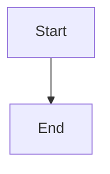

# confluence-publish-markdown — supported markdown subset

The skill uses `mistletoe` to parse markdown into an AST, then walks the AST emitting ADF (Atlassian Document Format) nodes. This doc is the contract for what's supported.

## ✅ Supported elements

| Markdown | ADF result | Notes |
|---|---|---|
| `# H1` through `###### H6` | heading (level 1-6) | First H1 becomes page title (auto-stripped from body) unless `--title` overrides |
| Paragraphs | paragraph | Inline marks preserved |
| `**bold**` | text + `strong` mark | |
| `_italic_` or `*italic*` | text + `em` mark | |
| `` `code` `` | text + `code` mark | |
| `~~strike~~` | text + `strike` mark | |
| `[label](url)` | text + `link` mark | |
| `<https://...>` (autolink) | text + `link` mark | URL becomes both label and target |
| `- item` / `* item` (bullet) | bulletList | Nested lists supported |
| `1. item` (numbered) | orderedList | Nested lists supported |
| ` ``` ` fenced code blocks | codeBlock | Language preserved (`python`, `bash`, `sql`, etc.) |
| ` ```mermaid ` | mediaSingle (external) | **Special**: rendered via mermaid.ink → URL embedded as external image |
| Indented (4-space) code | codeBlock language=text | Less common; works |
| `> quote` | blockquote | Multi-line quotes supported |
| `---` / `***` | rule (horizontal divider) | |
| Pipe tables | table (header + body rows) | Header inferred from first row + separator |
| Hard break (two trailing spaces + newline) | hardBreak | Inside paragraphs |

## ❌ Not supported / passes through as text

| Markdown | What happens | Workaround |
|---|---|---|
| `` images | rendered as `[image: alt]` italicized text | Use mermaid for diagrams; for photos, attach manually via Confluence editor after publish |
| LaTeX math `$x^2$` / `$$\\sum$$` | passes as raw text | None — Confluence has math macros but they're not in markdown subset |
| Footnotes `[^1]` | passes as raw text | Inline in main text, or use a "References" section |
| Definition lists | passes as raw text | Convert to bullet list with bolded terms |
| HTML blocks | wrapped as language=html code block | Discouraged — markdown shouldn't carry HTML |
| Task lists `- [ ] todo` | renders as bullet list with `[ ]` literal text | Use `/jira-create-vertical-slices` or direct ADF API for true taskList |
| Frontmatter (YAML between `---`) | parses as a horizontal rule + heading | Strip frontmatter from markdown before publish, or use `--title` to override |

## Mermaid diagram syntax

Use a fenced code block with `mermaid` as the language:

````markdown

````

The skill:
1. Extracts the source code between the fences
2. URL-encodes it via `pako` compression (matches mermaid.ink's URL scheme)
3. Generates `https://mermaid.ink/img/pako:<encoded>?type=png&bgColor=white`
4. Embeds as ADF mediaSingle with `type: external`, layout `wide`

Pre-flight (`--validate-only`) renders each mermaid block to verify syntax compiles. Errors at this stage usually mean the mermaid source is invalid.

## Tables — what's supported

Standard pipe tables. Alignment markers (`:---:`, `---:`) are parsed but ignored — ADF tables don't expose per-cell alignment in a simple way.

```markdown
| Header A | Header B | Header C |
|----------|----------|----------|
| cell 1   | `code`   | **bold** |
| cell 2   | _italic_ | [link](https://x) |
```

Renders to a Confluence table with the first row as `tableHeader` cells and subsequent rows as `tableCell`. Inline marks are preserved.

**Tables don't support:**
- Multi-line cells (wrap each cell to one line in the source)
- Merged cells (rowspan/colspan)
- Cell-level color or background

For complex tables, edit the page in the Confluence UI after publish.

## Code blocks — language hints

The fenced code-block language tag flows through to ADF's `codeBlock.attrs.language`. Common values:

- `python`, `bash`, `sql`, `json`, `yaml`, `javascript`, `typescript`, `go`, `rust`, `java`
- `text` (no syntax highlighting) for plain output / logs
- `mermaid` is special-cased (becomes a diagram, not a code block)
- Unknown languages default to `text`

Language tag is case-insensitive (`Python`, `python`, `PYTHON` all work).

## Line breaks within paragraphs

A single newline within a paragraph collapses to a space (CommonMark default). For a hard break:

- Two trailing spaces then newline → ADF `hardBreak` node
- Or a backslash at end of line (CommonMark) → `hardBreak`

Don't rely on hard breaks for layout; use proper paragraphs.

## What about Confluence-native macros (panels, expand, etc.)?

The markdown subset doesn't have a way to express `<panel type="info">...</panel>` or expand-collapse blocks. The skill's only Confluence-native injection is the optional **header info panel** (configured via `--header-config`).

For other native macros, edit the page in the Confluence UI after publish. Future enhancement: blockquote-with-syntax convention (e.g. `> [!info] ...` à la GitHub) → ADF panel. Not implemented yet.
